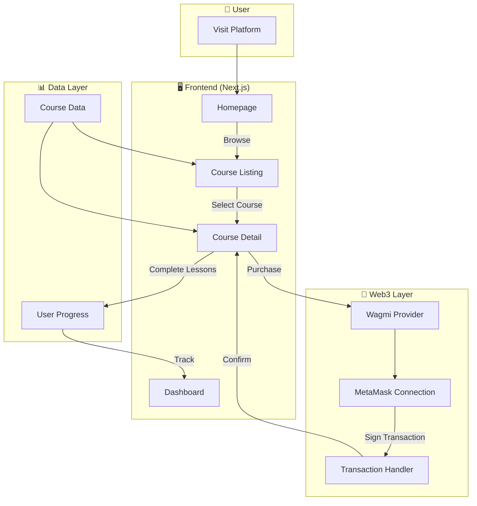

# ArbiLearn - Web3 Learning Platform

A decentralized learning platform built on the Arbitrum blockchain, enabling users to learn blockchain development while earning NFT certificates and on-chain credentials.

---

## 🚀 Features

- **Wallet Integration**: Connect MetaMask via Wagmi for seamless Web3 authentication
- **Course Marketplace**: Browse and purchase courses with ETH/Arbitrum
- **Interactive Learning**: Video lessons, quizzes, and hands-on exercises
- **NFT Certificates**: Earn verifiable on-chain credentials upon completion
- **3D Visual Experience**: Immersive Spline 3D backgrounds
- **Command Palette Search**: Quick course search with `Cmd+K` / `Ctrl+K`
- **Responsive Design**: Modern glassmorphism UI with dark mode support

---

## 🛠️ Tech Stack

| Category | Technologies |
|----------|-------------|
| **Frontend** | Next.js 16, React 19, TypeScript |
| **Styling** | Tailwind CSS 4, Framer Motion, GSAP |
| **Web3** | Wagmi 3, Viem, MetaMask |
| **UI Components** | Radix UI, Shadcn/ui, Lucide Icons |
| **3D Graphics** | Spline (@splinetool/react-spline) |
| **State Management** | TanStack React Query |

---

## 📁 Project Architecture

```
crypto-learning-d-app/
├── app/                          # Next.js App Router
│   ├── layout.tsx                # Root layout with providers
│   ├── page.tsx                  # Homepage (Hero, Features, Courses)
│   ├── globals.css               # Global styles & Tailwind config
│   ├── about/                    # About page
│   │   └── page.tsx
│   ├── support/                  # Support/Contact page
│   │   └── page.tsx
│   ├── courses/                  # Course routes
│   │   ├── page.tsx              # Course listing with search/filter
│   │   └── [id]/                 # Dynamic course detail route
│   │       └── page.tsx          # Individual course page with lessons
│   └── dashboard/                # User dashboard
│       └── page.tsx
│
├── components/                   # Reusable components
│   ├── ui/                       # Shadcn/UI primitives
│   ├── providers.tsx             # Wagmi + React Query providers
│   ├── search-bar.tsx            # Command palette search
│   ├── spline-background.tsx     # 3D animated background
│   ├── wallet-button.tsx         # Wallet connection button
│   └── theme-provider.tsx        # Dark/Light theme provider
│
├── lib/                          # Utilities & shared logic
│   ├── data.ts                   # Course data & type definitions
│   ├── utils.ts                  # Helper functions
│   └── wagmi.ts                  # Wagmi configuration
│
├── hooks/                        # Custom React hooks
│   └── use-mobile.ts             # Mobile detection hook
│
├── public/                       # Static assets
│   └── *.jpg                     # Course thumbnails
│
└── styles/                       # Additional stylesheets
```

---

## 🔄 System Flow



### User Journey

1. **Landing** → User visits homepage, views featured courses
2. **Browse** → Navigate to `/courses`, filter by level, search courses
3. **Connect Wallet** → Click "Connect MetaMask" to authenticate
4. **Purchase** → Select paid course, approve transaction
5. **Learn** → Watch lessons, complete quizzes
6. **Earn** → Receive XP tokens and NFT certificate on completion

---

## 🏃 Getting Started

### Prerequisites

- Node.js 18+
- pnpm (recommended) or npm
- MetaMask browser extension

### Installation

```bash
# Clone the repository
git clone <repository-url>
cd crypto-learning-d-app

# Install dependencies
pnpm install

# Start development server
pnpm dev
```

Open [http://localhost:3000](http://localhost:3000) in your browser.

### Build for Production

```bash
pnpm build
pnpm start
```

---

## 🔧 Configuration

### Wagmi Setup (`lib/wagmi.ts`)

The platform is configured for Arbitrum Mainnet. Modify the config for different networks:

```typescript
import { arbitrum } from 'wagmi/chains'
import { createConfig, http } from 'wagmi'

export const config = createConfig({
  chains: [arbitrum],
  transports: {
    [arbitrum.id]: http(),
  },
})
```

---

## 📄 Key Components

| Component | Purpose |
|-----------|---------|
| `providers.tsx` | Wraps app with Wagmi & React Query providers |
| `search-bar.tsx` | Command palette for quick course search |
| `spline-background.tsx` | 3D animated background scene |
| `wallet-button.tsx` | Wallet connection/disconnection UI |
| `lib/data.ts` | Centralized course data & TypeScript interfaces |

---

## 🎨 Design System

- **Colors**: Blue-Purple gradient palette (`#60a5fa` → `#a78bfa`)
- **Typography**: System fonts with Tailwind defaults
- **Effects**: Glassmorphism, backdrop blur, subtle animations
- **Layout**: Responsive grid with mobile-first approach

---

## 📝 License

This project is for educational purposes.

---

## 🤝 Contributing

1. Fork the repository
2. Create a feature branch (`git checkout -b feature/amazing-feature`)
3. Commit changes (`git commit -m 'Add amazing feature'`)
4. Push to branch (`git push origin feature/amazing-feature`)
5. Open a Pull Request
